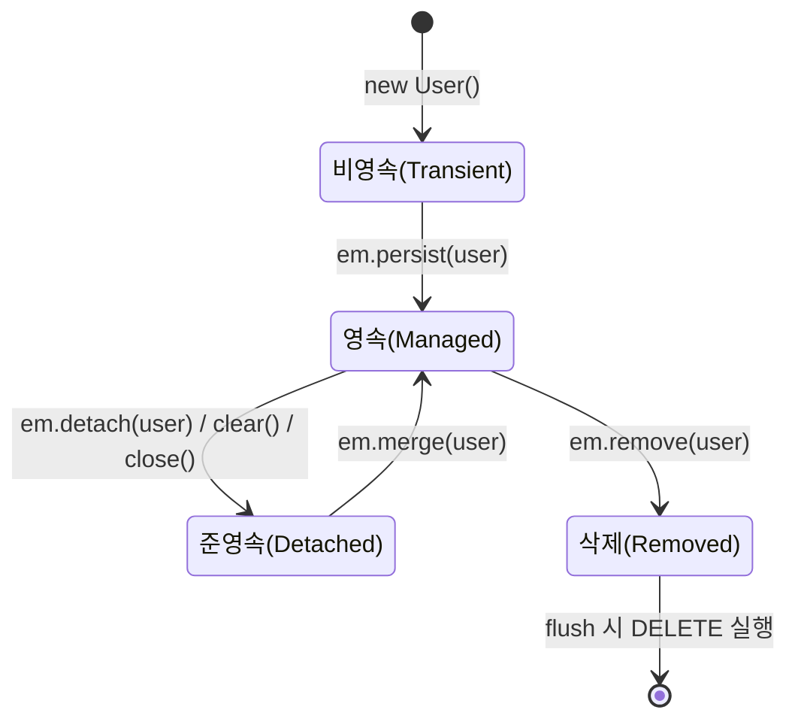

# JPA 심화편: 영속성 컨텍스트의 생명주기, 연관관계 매핑, 그리고 N+1 문제

이전 글([Spring의 DB 연결 구조 파헤치기](spring-db.md))에서 JPA의 기본 동작(EntityManager, 1차 캐시, Dirty Checking)을 다뤘습니다. 이번에는 그보다 한 단계 더 들어가서, **엔티티의 생명주기**, **연관관계 매핑**, 그리고 실무에서 가장 많이 마주치는 **N+1 문제**를 자세히 정리합니다.

---

## 1. 엔티티의 4가지 생명주기 상태

JPA에서 엔티티 객체는 단순한 자바 객체가 아니라, **영속성 컨텍스트와의 관계에 따라 4가지 상태** 중 하나를 가집니다.



| 상태 | 설명 | 예시 |
|---|---|---|
| **비영속 (Transient)** | 영속성 컨텍스트와 전혀 관계없는 순수 자바 객체 | `User user = new User();` |
| **영속 (Managed)** | 영속성 컨텍스트가 관리 중 — 1차 캐시에 저장, 변경 감지 대상 | `em.persist(user);` 또는 `em.find()`로 조회한 엔티티 |
| **준영속 (Detached)** | 한 번 영속 상태였다가 컨텍스트에서 분리됨 — 더 이상 변경 감지 안 됨 | `em.detach(user)`, 트랜잭션 종료 후 컨트롤러로 넘어간 엔티티 |
| **삭제 (Removed)** | 삭제 예정으로 표시된 상태 | `em.remove(user);` |

**실무에서 가장 자주 헷갈리는 지점**: 트랜잭션이 끝나면 영속성 컨텍스트도 함께 사라지고, 그 안에서 조회했던 엔티티는 자동으로 **준영속** 상태가 됩니다. 준영속 엔티티는:

- 변경해도 Dirty Checking이 동작하지 않음 (DB에 반영 안 됨)
- Lazy 필드를 건드리면 `LazyInitializationException` 발생

```java
@Transactional
public User getUser(Long id) {
    return userRepository.findById(id).orElseThrow(); // 여기서는 영속 상태
} // 메서드 종료 → 트랜잭션 종료 → 컨텍스트 종료 → 반환된 user는 준영속 상태
```

---

## 2. 영속성 컨텍스트 내부 동작 — 1차 캐시, 쓰기 지연, Flush

영속성 컨텍스트는 단순한 "캐시"가 아니라 세 가지 역할을 동시에 합니다.

### 2.1 1차 캐시 & 동일성 보장

```java
User a = em.find(User.class, 1L); // SELECT 쿼리 실행
User b = em.find(User.class, 1L); // 쿼리 없이 1차 캐시에서 반환
System.out.println(a == b); // true — 같은 트랜잭션 안에서는 동일 객체 보장
```

### 2.2 쓰기 지연 SQL 저장소

`em.persist()`를 호출해도 INSERT 쿼리가 즉시 나가지 않습니다. 영속성 컨텍스트 내부의 "쓰기 지연 SQL 저장소"에 SQL을 쌓아두었다가, **flush 시점에 한꺼번에** DB로 보냅니다.

### 2.3 Flush가 일어나는 시점

| 시점 | 설명 |
|---|---|
| 트랜잭션 커밋 직전 | 가장 흔한 경우 — commit() 호출 시 자동 flush |
| JPQL/QueryDSL 실행 직전 | 캐시에만 있고 DB에 없는 데이터를 조회 못 하는 걸 방지하기 위해 자동 flush |
| `em.flush()` 명시적 호출 | 수동으로 강제 flush |

> Flush는 "커밋"이 아닙니다. SQL을 DB로 전송할 뿐, 트랜잭션은 아직 끝나지 않았고 언제든 롤백 가능합니다.

---

## 3. 연관관계 매핑

### 3.1 단방향 vs 양방향, 그리고 "연관관계의 주인"

테이블은 외래키(FK) 하나로 항상 "양쪽에서" 조인할 수 있지만, 객체는 참조를 가진 쪽만 상대를 알 수 있습니다. 이 차이 때문에 JPA에서는 **연관관계의 주인(Owner)** 개념이 필요합니다 — **FK를 관리하는 쪽(주인)만 값을 변경할 수 있고, 반대편(`mappedBy`)은 조회만 가능한 거울일 뿐**입니다.

```java
@Entity
class Team {
    @OneToMany(mappedBy = "team") // 주인이 아님 — 조회 전용
    List<Member> members = new ArrayList<>();
}

@Entity
class Member {
    @ManyToOne
    @JoinColumn(name = "team_id") // FK를 가진 쪽 = 연관관계의 주인
    Team team;
}
```

**규칙**: 보통 **FK가 있는 테이블에 매핑된 엔티티(`@ManyToOne` 쪽)가 연관관계의 주인**이 됩니다. `members.add(member)`만 해서는 DB에 반영되지 않고, 반드시 주인인 `member.setTeam(team)`을 호출해야 FK가 업데이트됩니다.

### 3.2 연관관계 매핑 종류 정리

| 애노테이션 | 관계 | 비고 |
|---|---|---|
| `@ManyToOne` | N:1 (대부분의 FK 보유 쪽) | 기본 fetch = EAGER (주의!) |
| `@OneToMany` | 1:N | 기본 fetch = LAZY, `mappedBy` 필요 (주인이 아닐 때) |
| `@OneToOne` | 1:1 | FK를 어느 쪽에 둘지 설계 선택 필요 |
| `@ManyToMany` | N:M | **실무에서는 지양** — 중간 테이블에 컬럼 추가 불가 등 한계 → 중간 엔티티(`@OneToMany` 2개)로 풀어서 사용 권장 |

---

## 4. N+1 문제 — JPA를 쓰면서 가장 많이 만나는 함정

### 4.1 문제 상황

```java
List<Team> teams = teamRepository.findAll(); // 쿼리 1번: SELECT * FROM team

for (Team team : teams) {
    System.out.println(team.getMembers().size()); // Lazy 로딩 → team마다 추가 쿼리 1번씩!
}
```

`team` 목록을 가져오는 쿼리 1번(`1`) + 각 team마다 members를 지연 로딩하며 날리는 쿼리 N번(`N`) = **총 1+N번의 쿼리**가 실행됩니다. Team이 100개면 쿼리가 101번 나가는 심각한 성능 문제입니다.

> 참고로 `@ManyToOne`/`@OneToOne`은 기본 fetch 전략이 **EAGER**라서, 얼핏 "즉시 다 가져오니 안전해 보이지만" 오히려 의도치 않은 조인이 계속 늘어나는 원인이 되기도 합니다. **실무에서는 연관관계를 기본적으로 모두 `LAZY`로 설정**하고, 필요한 시점에만 명시적으로 함께 조회하는 것이 정석입니다.

### 4.2 해결책

**① Fetch Join (JPQL)** — 가장 확실한 해결책, 한 번의 SQL JOIN으로 함께 조회

```java
@Query("SELECT t FROM Team t JOIN FETCH t.members")
List<Team> findAllWithMembers();
```

**② `@EntityGraph`** — 메서드 단위로 fetch 전략을 오버라이드

```java
@EntityGraph(attributePaths = {"members"})
@Query("SELECT t FROM Team t")
List<Team> findAllWithMembers();
```

**③ Batch Size 설정** — N번의 개별 쿼리를 `IN` 절을 쓰는 몇 번의 쿼리로 축소 (완전히 없애진 못하지만 크게 줄임)

```yaml
spring:
  jpa:
    properties:
      hibernate:
        default_batch_fetch_size: 100
```

```sql
-- team_id IN (1,2,3,...,100) 형태로 묶어서 조회 → 쿼리 수를 1+N에서 1+(N/100)로 감소
```

| 해결책 | 장점 | 단점 |
|---|---|---|
| Fetch Join | 쿼리 1번으로 완전 해결 | 페이징(`Pageable`)과 함께 쓰면 메모리에서 페이징 처리 → 성능 경고 발생 가능 |
| `@EntityGraph` | 코드가 간결, 재사용 쉬움 | Fetch Join과 동일한 페이징 이슈 존재 |
| Batch Size | 페이징과 함께 써도 안전 | 쿼리가 완전히 1번으로 줄지는 않음 (N → N/batchSize) |

---

## 5. Cascade와 orphanRemoval

연관된 엔티티의 생명주기를 부모 엔티티와 함께 관리하고 싶을 때 사용합니다.

```java
@OneToMany(mappedBy = "team", cascade = CascadeType.ALL, orphanRemoval = true)
List<Member> members = new ArrayList<>();
```

| 옵션 | 의미 |
|---|---|
| `CascadeType.PERSIST` | 부모를 저장하면 자식도 함께 저장 |
| `CascadeType.REMOVE` | 부모를 삭제하면 자식도 함께 삭제 |
| `orphanRemoval = true` | 부모의 컬렉션에서 자식을 제거(`list.remove()`)하면 그 자식을 DB에서도 삭제 |

> `cascade`는 "생명주기를 부모가 전적으로 책임지는" 강한 소유 관계(예: 게시글-댓글)에서만 사용해야 합니다. 여러 부모가 공유하는 엔티티(예: Team-Member처럼 Member가 독립적으로 존재 가능한 경우)에 잘못 걸면 의도치 않은 대량 삭제가 발생할 수 있습니다.

---

## 6. JPQL, Criteria, QueryDSL 간단 비교

| 방식 | 특징 |
|---|---|
| **JPQL** | 엔티티 객체를 대상으로 한 객체지향 쿼리 언어. SQL과 비슷하지만 테이블이 아닌 엔티티/필드명을 사용 |
| **Criteria API** | 자바 코드로 쿼리를 조립 (타입 안전하지만 코드가 장황해서 실무에서 잘 안 씀) |
| **QueryDSL** | Criteria의 단점을 보완한 오픈소스 — 컴파일 타임에 타입 체크되는 SQL과 유사한 문법으로 동적 쿼리 작성에 강함, 실무 표준처럼 널리 사용 |

```java
// QueryDSL 예시
List<Team> result = queryFactory
    .selectFrom(team)
    .leftJoin(team.members, member).fetchJoin()
    .where(team.name.eq("A팀"))
    .fetch();
```

---

## 7. 2차 캐시 (짧게)

1차 캐시는 "트랜잭션(영속성 컨텍스트) 범위"였다면, **2차 캐시**는 `EntityManagerFactory` 레벨 — 즉 **애플리케이션 전체에서 공유**되는 캐시입니다. Hibernate는 기본적으로 비활성화되어 있고, EhCache/Redis 등을 붙여 조회가 잦고 거의 변하지 않는 데이터(공통 코드 테이블 등)에 한정적으로 사용하는 것이 일반적입니다.

---

## 8. 정리

- 엔티티는 **비영속 → 영속 → 준영속/삭제**의 생명주기를 가지며, 트랜잭션이 끝나면 조회했던 엔티티는 준영속 상태가 되어 변경 감지도, Lazy 로딩도 더 이상 동작하지 않는다.
- 연관관계에는 반드시 **주인(FK를 가진 쪽)** 이 있고, 주인만이 실제 DB 반영을 트리거할 수 있다.
- 연관관계는 기본을 **모두 LAZY**로 설정하고, N+1 문제는 Fetch Join / `@EntityGraph` / Batch Size 중 상황에 맞는 방법으로 해결한다.
- `cascade`와 `orphanRemoval`은 부모-자식이 생명주기를 온전히 공유하는 강한 소유 관계에만 신중히 적용한다.
- 복잡한 동적 쿼리가 필요하다면 QueryDSL이 사실상 실무 표준이다.
