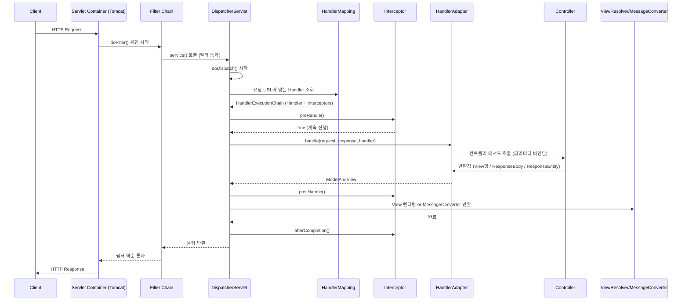

# Servlet 부터 Spring까지: HTTP 요청이 처리되는 전 과정 파헤치기

Spring MVC로 웹 애플리케이션을 만들다 보면 `@Controller`, `@RequestMapping` 몇 개만 붙여도 "알아서" 요청이 처리되는 것처럼 느껴집니다. 하지만 그 이면에는 **Servlet Container → Filter → DispatcherServlet → HandlerMapping → Interceptor → Controller → ViewResolver**로 이어지는 명확한 파이프라인이 존재합니다. 이 글에서는 클라이언트가 요청을 보낸 순간부터 응답을 받기까지, 요청이 거쳐가는 모든 단계를 순서대로 정리합니다.

---

## 1. Servlet이란 무엇인가

Servlet은 **Java EE(Jakarta EE) 표준 스펙**으로, "자바로 작성된, HTTP 요청/응답을 다루는 서버 사이드 컴포넌트"입니다. 우리가 실제로 사용하는 것은 이 스펙을 구현한 **Servlet Container**(대표적으로 Tomcat)입니다.

### 1.1 Servlet 생명주기

Servlet Container는 `javax.servlet.Servlet` (Jakarta EE 9+에서는 `jakarta.servlet.Servlet`) 인터페이스의 생명주기를 관리합니다.

| 단계     | 메서드                                        | 호출 시점                          | 호출 횟수 |
| ------ | ------------------------------------------ | ------------------------------ | ----- |
| 로딩/초기화 | `init(ServletConfig)`                      | Servlet이 최초로 메모리에 올라갈 때        | 1회    |
| 요청 처리  | `service(ServletRequest, ServletResponse)` | 요청이 들어올 때마다                    | 요청마다  |
| 소멸     | `destroy()`                                | Container가 종료되거나 Servlet을 내릴 때 | 1회    |

`HttpServlet`을 상속하면 `service()`가 내부적으로 HTTP 메서드에 따라 `doGet()`, `doPost()`, `doPut()`, `doDelete()` 등으로 분기해줍니다. **Spring의 핵심인 `DispatcherServlet` 역시 결국 `HttpServlet`을 상속한 하나의 Servlet일 뿐입니다.**

### 1.2 Servlet Container가 하는 일

Tomcat 같은 Servlet Container는 다음을 담당합니다.

- 소켓 연결 수립, TCP/HTTP 프로토콜 파싱
- `HttpServletRequest` / `HttpServletResponse` 객체 생성
- URL과 등록된 Servlet을 매핑 (`web.xml` 또는 `@WebServlet`)
- **Filter Chain** 구성 및 실행
- Servlet 생명주기 관리, 멀티스레딩 처리

즉, Spring이 동작하기 이전에 이미 "Servlet Container"라는 하나의 큰 문지기가 존재하고, Spring(DispatcherServlet)은 그 문지기가 등록해준 여러 Servlet 중 **하나**로서 동작한다는 점이 핵심입니다.

---

## 2. Spring은 Servlet 위에서 어떻게 동작하는가

Spring MVC는 **Front Controller 패턴**을 사용합니다. 모든 요청을 하나의 진입점(`DispatcherServlet`)이 받아서, 그 뒤로 적절한 컨트롤러에 위임하는 구조입니다.

```
web.xml / Java Config
  <servlet-mapping>
      <url-pattern>/</url-pattern>   <!-- 모든 요청이 DispatcherServlet으로 -->
  </servlet-mapping>
```

Spring Boot를 쓴다면 `DispatcherServletAutoConfiguration`이 이 설정을 자동으로 해줍니다.

---

## 3. 전체 요청 처리 순서 (End-to-End)

아래는 클라이언트 요청이 들어와서 응답이 나갈 때까지의 **전체 흐름**입니다.



이제 이 각 단계를 코드 관점에서 자세히 뜯어보겠습니다.

---

## 4. 단계별 상세 설명

### Step 1. Servlet Container가 요청을 수신

Tomcat이 TCP 연결을 받고, HTTP 요청 라인/헤더/바디를 파싱해 `HttpServletRequest` 객체를 만듭니다. 이후 요청 URL을 기준으로 어떤 Servlet(대부분의 경우 `DispatcherServlet` 하나)에게 넘길지 결정합니다.

### Step 2. Filter Chain 통과 (요청 진입 시)

Servlet 스펙에 정의된 `Filter`는 **Servlet에 도달하기 전/후에 실행되는 전처리·후처리기**입니다.

```java
public interface Filter {
    void doFilter(ServletRequest req, ServletResponse res, FilterChain chain);
}
```

- `doFilter()` 안에서 `chain.doFilter(req, res)`를 호출하기 **전** 코드는 요청이 들어올 때 실행
- `chain.doFilter()` 호출 **이후** 코드는 응답이 나갈 때 실행 (마치 스택처럼 역순으로 되감김)
- 대표 예시: 인코딩 필터(`CharacterEncodingFilter`), CORS 필터, 로깅 필터, **Spring Security의 `DelegatingFilterProxy`**

> Filter는 Servlet 스펙 소속이라 **Spring 컨텍스트 밖**에서도 동작하며, DispatcherServlet보다 먼저/나중에 실행됩니다.

### Step 3. DispatcherServlet 진입 — `FrameworkServlet.service()`

Filter Chain을 모두 통과하면 드디어 `DispatcherServlet`(정확히는 부모 클래스 `FrameworkServlet`)의 `service()` → `doGet()`/`doPost()` → `processRequest()` → **`doService()`** 가 호출됩니다.

### Step 4. HandlerMapping — "누가 이 요청을 처리할지" 결정

`DispatcherServlet.doDispatch()`의 첫 일감은 `getHandler(request)`입니다.

- 등록된 `HandlerMapping` 구현체들(`RequestMappingHandlerMapping` 등)을 순회하며 요청 URL/HTTP Method에 맞는 핸들러(주로 `@Controller`의 특정 메서드)를 찾음
- 이때 반환되는 것은 단순 컨트롤러가 아니라 **`HandlerExecutionChain`** — 컨트롤러 + 해당 요청에 적용될 `HandlerInterceptor` 목록을 함께 감싼 객체

### Step 5. HandlerAdapter 선택

찾은 핸들러 타입에 맞는 `HandlerAdapter`(대부분 `RequestMappingHandlerAdapter`)를 선택합니다. Adapter 패턴을 쓰는 이유는 핸들러가 `@Controller` 메서드일 수도, `HttpRequestHandler`일 수도, 옛날 방식 `Controller` 인터페이스일 수도 있기 때문에 **호출 방식을 추상화**하기 위함입니다.

### Step 6. Interceptor `preHandle()` 실행

`HandlerExecutionChain`에 등록된 `HandlerInterceptor`들의 `preHandle()`이 **등록 순서대로** 실행됩니다.

```java
public interface HandlerInterceptor {
    boolean preHandle(...);   // 컨트롤러 실행 전
    void postHandle(...);     // 컨트롤러 실행 후, 뷰 렌더링 전
    void afterCompletion(...);// 뷰 렌더링까지 끝난 후 (항상 호출)
}
```

- `preHandle()`이 `false`를 반환하면 그 즉시 체인이 끊기고 컨트롤러는 호출되지 않음 (인증/인가 체크에 자주 사용)

### Step 7. Controller 메서드 호출

`HandlerAdapter.handle()`이 실제 컨트롤러 메서드를 호출합니다. 이 과정에서:

1. **`HandlerMethodArgumentResolver`** 들이 메서드 파라미터를 채워줌 (`@RequestParam`, `@PathVariable`, `@RequestBody`, `@ModelAttribute` 등)
2. `@RequestBody`가 있다면 **`HttpMessageConverter`** 가 요청 바디(JSON 등)를 자바 객체로 역직렬화
3. 비즈니스 로직(Service, Repository 계층 호출 등)이 여기서 실행
4. 메서드 반환값을 **`HandlerMethodReturnValueHandler`** 가 처리
   - View 이름(String) → 그대로 전달
   - `@ResponseBody` / `@RestController` → `HttpMessageConverter`가 객체를 JSON 등으로 직렬화
   - `ResponseEntity<T>` → 상태 코드/헤더/바디를 함께 처리

### Step 8. Interceptor `postHandle()` 실행

컨트롤러 실행이 끝나면 등록된 Interceptor들의 `postHandle()`이 **역순으로** 실행됩니다. (아직 응답이 클라이언트로 나가기 전이라 `ModelAndView`를 조작할 수 있는 마지막 기회)

### Step 9. View 렌더링 (혹은 메시지 변환)

- 일반 `@Controller` + View 이름 반환 → `ViewResolver`가 논리적 뷰 이름을 실제 `View` 구현체(JSP, Thymeleaf 등)로 변환 → `View.render()` 실행
- `@RestController` / `@ResponseBody` → 이미 Step 7에서 `HttpMessageConverter`가 응답 바디를 직접 써버렸으므로 별도 View 렌더링 없이 종료

### Step 10. Interceptor `afterCompletion()` 실행

요청 처리(뷰 렌더링 포함)가 완전히 끝난 뒤 역순으로 호출됩니다. **예외가 발생해도 반드시 호출**되므로 리소스 정리, 로깅에 사용됩니다.

### Step 11. 응답이 Filter Chain을 역순으로 통과

`DispatcherServlet.service()`가 리턴하면, 처음 요청을 감쌌던 Filter들의 `doFilter()` 이후 코드(=`chain.doFilter()` 다음 줄)가 **등록 순서의 역순**으로 실행됩니다.

### Step 12. Servlet Container가 최종 응답을 클라이언트에 전송

---

## 5. 한눈에 보는 요청/응답 순서 요약

```
[요청]
Client
 → Servlet Container (Tomcat 소켓/스레드 처리)
 → Filter 1 preprocessing → Filter 2 preprocessing → ...
 → DispatcherServlet.doDispatch()
     → HandlerMapping (핸들러 탐색)
     → HandlerAdapter 선택
     → Interceptor.preHandle() [순서대로]
     → Controller 메서드 실행 (ArgumentResolver → 비즈니스 로직 → ReturnValueHandler)
     → Interceptor.postHandle() [역순]
     → ViewResolver / HttpMessageConverter
     → Interceptor.afterCompletion() [역순]
 → Filter 2 postprocessing → Filter 1 postprocessing (역순)
 → Servlet Container 응답 전송
[응답]
Client
```

---

## 6. Filter vs Interceptor — 헷갈리는 두 개념 정리

| 구분 | Filter | Interceptor |
|---|---|---|
| 소속 | Servlet 스펙 (Java EE) | Spring MVC |
| 실행 시점 | DispatcherServlet **앞뒤** | DispatcherServlet **내부**, 핸들러 실행 전후 |
| DI 컨테이너 접근 | 제한적 (ServletContext 기반) | 자유로움 (Spring Bean 자유롭게 주입) |
| 용도 | 인코딩, CORS, 인증 토큰 파싱, 로깅 (요청 전반) | 컨트롤러 단위 인가 체크, 공통 로직, 핸들러 정보 활용 |
| 대표 예 | `DelegatingFilterProxy` (Spring Security) | `HandlerInterceptor` 구현체 |

## 7. 참고: Spring Security는 어디에 끼어드는가

Spring Security는 **Filter**로 동작합니다. `DelegatingFilterProxy`라는 하나의 Servlet Filter가 Servlet Container의 Filter Chain에 등록되고, 그 내부에서 다시 Spring이 관리하는 여러 보안 Filter(`FilterChainProxy` 산하의 `UsernamePasswordAuthenticationFilter`, `BasicAuthenticationFilter` 등)들을 순차 실행합니다. 즉, **Spring Security의 인증/인가는 DispatcherServlet에 도달하기 전(Step 2)에 이미 끝나 있는 것**이 핵심 포인트입니다.

---

## 8. 핵심 요약

- Servlet Container(Tomcat)가 가장 바깥에서 요청을 받고, **Filter Chain**을 통과시킨 뒤에야 **DispatcherServlet**(Spring)에게 넘긴다.
- DispatcherServlet은 **Front Controller**로서 직접 비즈니스 로직을 처리하지 않고 `HandlerMapping` → `HandlerAdapter` → `Controller` 순으로 위임한다.
- `Interceptor`는 Spring 영역 내부(HandlerMapping이 찾아준 체인)에서 `preHandle → (Controller) → postHandle → afterCompletion` 순으로 동작한다.
- `Filter`는 Spring 바깥(Servlet 영역)에서 요청 전/응답 후에 한 번씩 감싸는 구조로 동작하며, 응답 처리는 항상 **등록 순서의 역순**으로 되감긴다.
- Spring Security도 결국 Filter 기반이라, Spring MVC의 Interceptor/Controller보다 훨씬 앞단에서 인증/인가를 처리한다.
