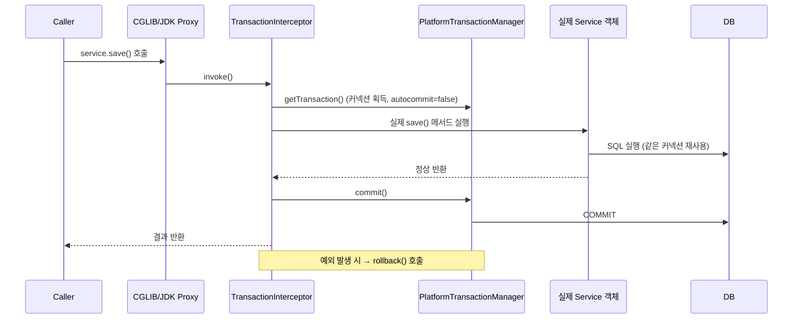

# Spring의 DB 연결 구조 파헤치기: MyBatis vs JPA, 그리고 @Transactional의 동작 원리

지난 글에서 HTTP 요청이 Servlet Container부터 Spring의 Controller까지 어떻게 흘러가는지 정리했습니다. 이번에는 그 Controller가 호출하는 **Service → Repository 계층에서 실제로 DB에 접근하는 과정**을 알아보겠습니다. MyBatis와 JPA가 각각 어떻게 Connection을 다루는지, 그리고 그 위에서 `@Transactional`이 어떻게 동작하는지가 핵심입니다.

---

## 1. 모든 것의 시작 — DataSource와 Connection Pool

Spring이든 MyBatis든 JPA든, 결국 밑바닥에는 **JDBC**가 있습니다. JDBC는 "자바에서 DB에 접근하는 표준 API"이고, 그 시작점은 `javax.sql.DataSource`입니다.

```java
Connection conn = dataSource.getConnection();
```

매 요청마다 물리적 Connection을 새로 맺으면 비용이 크기 때문에, 실무에서는 **Connection Pool**(대표적으로 HikariCP, Spring Boot 기본값)을 사용합니다.

- 애플리케이션 시작 시 커넥션을 미리 N개 만들어 풀(Pool)에 보관
- 요청이 오면 풀에서 커넥션을 "빌려서" 쓰고, 끝나면 "반납"(close 해도 실제 연결은 끊기지 않고 풀로 돌아감)
- `HikariConfig`로 `maximum-pool-size`, `connection-timeout` 등을 튜닝

```yaml
spring:
  datasource:
    hikari:
      maximum-pool-size: 10
      connection-timeout: 3000
```

MyBatis와 JPA는 **이 DataSource 위에 얹혀진 서로 다른 추상화 계층**일 뿐입니다.

---

## 2. MyBatis — SQL을 직접 다루는 반(半)-ORM

### 2.1 핵심 구성요소

```
SqlSessionFactoryBuilder → SqlSessionFactory → SqlSession → Mapper Interface
```

| 구성요소 | 역할 | 생명주기 |
|---|---|---|
| `SqlSessionFactory` | SqlSession을 만드는 공장 | 애플리케이션 전체에서 1개 (싱글턴) |
| `SqlSession` | 실제 SQL 실행, Connection을 감싸고 있음 | 요청(트랜잭션) 단위로 생성/종료 |
| Mapper Interface | `@Mapper` 인터페이스 — 실제로는 `SqlSession`을 호출하는 동적 프록시 | - |

### 2.2 요청 처리 흐름

```
Controller → Service → Mapper Interface 호출
  → MyBatis-Spring이 만든 동적 프록시(MapperProxy)가 가로챔
  → SqlSession.selectOne()/insert()/update() 호출
  → SqlSession이 DataSource에서 Connection을 얻음 (트랜잭션 内라면 기존 커넥션 재사용)
  → MappedStatement(XML 또는 애노테이션에 작성한 SQL)를 실행
  → PreparedStatement 파라미터 바인딩 (#{} 문법)
  → ResultSet → Java 객체로 매핑 (ResultMap)
  → Connection 반납 (Pool로 복귀)
```

Mapper XML 예시:

```xml
<select id="findById" parameterType="long" resultType="User">
    SELECT * FROM users WHERE id = #{id}
</select>
```

```java
@Mapper
public interface UserMapper {
    User findById(Long id);
}
```

**특징**: SQL을 개발자가 직접 작성하고 제어할 수 있음 (Full Control). 대신 객체 그래프 매핑, 캐시, 변경 감지 같은 ORM 기능은 없음.

---

## 3. JPA — 객체와 테이블을 매핑하는 진짜 ORM

### 3.1 핵심 구성요소

```
EntityManagerFactory → EntityManager → Persistence Context
```

| 구성요소                               | 역할                                             | 생명주기              |
| ---------------------------------- | ---------------------------------------------- | ----------------- |
| `EntityManagerFactory`             | EntityManager를 만드는 공장 (내부에 Connection Pool 참조) | 애플리케이션 전체 1개      |
| `EntityManager`                    | 엔티티의 CRUD를 담당하는 실질적 인터페이스                      | 트랜잭션(영속성 컨텍스트) 단위 |
| **Persistence Context (영속성 컨텍스트)** | EntityManager가 관리하는 1차 캐시 겸 변경 감지 영역           | 트랜잭션과 생명주기를 같이함   |

Spring Boot에서는 Hibernate가 JPA 표준의 구현체로 동작합니다.

### 3.2 요청 처리 흐름

```
Controller → Service(@Transactional) → Repository(JpaRepository) 호출
  → Spring Data JPA가 만든 프록시가 실행 시점에 EntityManager 위임
  → EntityManager.find()/persist()/merge() 호출
  → 1차 캐시(Persistence Context) 확인 → 없으면 SELECT 쿼리 생성 후 DB 조회
  → 조회 결과를 엔티티 객체로 변환, 영속 상태(Managed)로 등록
  → 트랜잭션 커밋 시점에 Dirty Checking(변경 감지) 수행
      → 엔티티 필드가 처음 로딩 시점(스냅샷)과 다르면 UPDATE 쿼리 자동 생성
  → Flush → 실제 SQL을 DB로 전송
  → 트랜잭션 커밋 → Connection 반납
```

핵심 차이점: **Dirty Checking**. JPA는 엔티티를 `find()`로 가져온 뒤, 필드 값만 바꾸면 별도의 `update()` 호출 없이도 트랜잭션 커밋 시점에 자동으로 UPDATE SQL을 만들어 날립니다.

```java
@Transactional
public void changeName(Long id, String newName) {
    User user = userRepository.findById(id).orElseThrow();
    user.setName(newName);
    // save() 호출 안 해도 커밋 시점에 UPDATE 쿼리 자동 실행
}
```

### 3.3 MyBatis vs JPA 비교

| 항목 | MyBatis | JPA (Hibernate) |
|---|---|---|
| SQL 작성 | 직접 작성 (XML/애노테이션) | 자동 생성 (JPQL/QueryDSL로 보완) |
| 학습 곡선 | 낮음 (SQL만 알면 됨) | 높음 (영속성 컨텍스트, 연관관계, N+1 이해 필요) |
| 캐시 | 기본 미지원 (별도 캐시 설정 필요) | 1차 캐시(필수) + 2차 캐시(선택) |
| 변경 감지 | 없음 (직접 update SQL 호출) | Dirty Checking으로 자동 반영 |
| 세밀한 SQL 튜닝 | 매우 쉬움 | JPQL/Native Query로 우회 필요 |
| 대표 사용처 | 복잡한 통계/리포트 쿼리, 레거시 | 도메인 중심 설계, 빠른 CRUD 개발 |

---

## 4. Spring이 이 둘을 하나의 틀로 묶는 방법 — `@Transactional`

MyBatis든 JPA든 결국 "하나의 트랜잭션 안에서 여러 SQL을 묶어 실행"해야 할 때가 있습니다. Spring은 `PlatformTransactionManager`라는 추상화로 이를 통일합니다.

| 사용 기술 | TransactionManager 구현체 |
|---|---|
| JDBC / MyBatis | `DataSourceTransactionManager` |
| JPA | `JpaTransactionManager` |

### 4.1 `@Transactional`은 어떻게 동작하는가 — AOP 프록시

`@Transactional`은 애노테이션 자체에 로직이 있는 게 아니라, **Spring AOP가 해당 빈을 프록시로 감싸서** 메서드 호출 전후에 트랜잭션 코드를 끼워 넣는 방식입니다.



핵심 포인트:

1. **프록시 기반**이므로 같은 클래스 내부에서 `this.otherMethod()`처럼 **자기 자신을 호출(self-invocation)**하면 프록시를 거치지 않아 `@Transactional`이 적용되지 않는다. (흔한 실수 1위)
2. 커넥션 하나를 트랜잭션 시작부터 끝(commit/rollback)까지 **ThreadLocal에 바인딩**해서 재사용한다 (`TransactionSynchronizationManager`).
3. MyBatis의 `SqlSession`도, JPA의 `EntityManager`도 내부적으로 이 ThreadLocal 커넥션을 찾아 재사용하도록 Spring이 연동해준다.

### 4.2 트랜잭션 전파(Propagation)와 격리 수준(Isolation)

```java
@Transactional(propagation = Propagation.REQUIRED, isolation = Isolation.READ_COMMITTED)
```

| Propagation | 의미 |
|---|---|
| `REQUIRED` (기본값) | 기존 트랜잭션이 있으면 참여, 없으면 새로 시작 |
| `REQUIRES_NEW` | 기존 트랜잭션을 잠시 보류하고 항상 새 트랜잭션 시작 |
| `NESTED` | 기존 트랜잭션 안에 savepoint를 두어 부분 롤백 가능 |
| `MANDATORY` | 반드시 기존 트랜잭션이 있어야 함, 없으면 예외 |

| Isolation | 의미 | 방지하는 문제 |
|---|---|---|
| `READ_UNCOMMITTED` | 커밋 안 된 데이터도 읽음 | - |
| `READ_COMMITTED` | 커밋된 데이터만 읽음 (대부분 DB 기본값) | Dirty Read |
| `REPEATABLE_READ` | 같은 트랜잭션 내 반복 조회 결과 동일 보장 | Non-repeatable Read |
| `SERIALIZABLE` | 완전 직렬화 (가장 엄격, 성능 저하) | Phantom Read |

### 4.3 JPA 사용 시 흔한 함정 — Lazy Loading과 트랜잭션 범위

```java
@Transactional
public UserDto getUser(Long id) {
    User user = userRepository.findById(id).orElseThrow();
    return new UserDto(user.getName(), user.getTeam().getName()); // team은 지연 로딩(LAZY)
}
```

`team`이 `FetchType.LAZY`라면, **트랜잭션(영속성 컨텍스트)이 살아있는 이 메서드 안에서만** `user.getTeam()`을 호출해 실제 쿼리를 날릴 수 있습니다. 트랜잭션이 끝난 뒤(예: Controller에서) 지연 로딩을 시도하면 `LazyInitializationException`이 발생합니다. → 이래서 `@Transactional`의 범위(어디서 끝나는지)를 정확히 이해하는 게 중요합니다.

---

## 5. 정리

- MyBatis와 JPA는 결국 같은 **DataSource / Connection Pool** 위에서 동작하는 서로 다른 데이터 접근 방식이다.
- MyBatis는 SQL을 직접 다루는 대신 세밀한 제어가 가능하고, JPA는 객체 중심 설계와 Dirty Checking으로 생산성을 높이지만 영속성 컨텍스트에 대한 이해가 필요하다.
- `@Transactional`은 AOP 프록시가 메서드 호출을 감싸서 트랜잭션 시작/커밋/롤백을 자동 처리하는 것이며, **자기 자신 호출로는 우회할 수 없다**.
- 트랜잭션 하나 = ThreadLocal에 바인딩된 커넥션 하나 = (JPA의 경우) 영속성 컨텍스트 하나의 생명주기라는 것을 기억하면 Lazy Loading, Dirty Checking 관련 버그를 훨씬 쉽게 이해할 수 있다.
