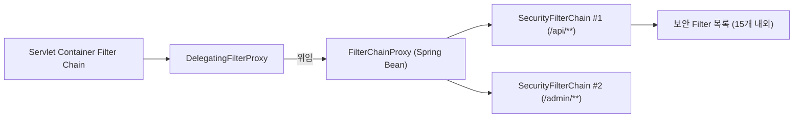
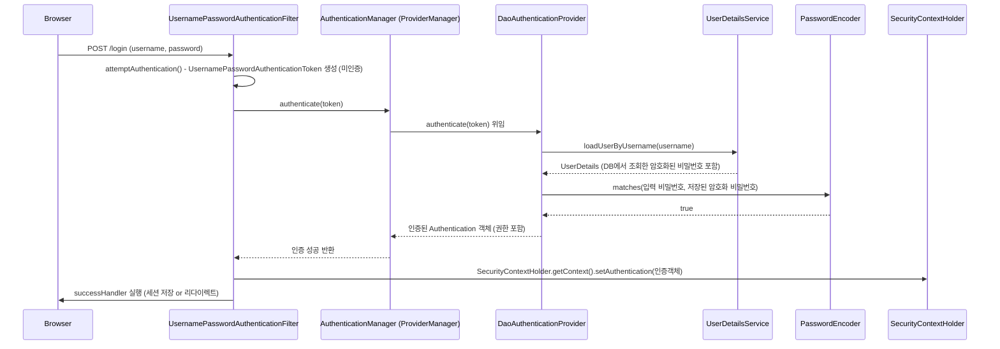

# Spring Security 아키텍처 총정리: Filter Chain부터 인증/인가 흐름까지

지난 글들에서 Spring MVC의 Filter Chain, 그리고 쿠키/세션/토큰 인증을 다루면서 "Spring Security도 결국 Filter다"라는 정도만 짚고 넘어갔습니다. 이번 글은 그 Filter 뭉치 안에 **정확히 무엇이 들어있고, 어떤 순서로 동작하며, 인증(Authentication)과 인가(Authorization)가 각각 어디서 이뤄지는지**를 정면으로 다룹니다.

---

## 1. 큰 그림 — DelegatingFilterProxy와 FilterChainProxy

첫 글에서 다뤘듯, Servlet Container는 자신만의 Filter Chain을 갖고 있습니다. Spring Security는 이 Filter Chain에 **`DelegatingFilterProxy`라는 딱 하나의 Servlet Filter**만 등록합니다.



- `DelegatingFilterProxy`: Servlet 표준 Filter. 실제 로직은 없고 **Spring 컨텍스트의 빈에게 위임**만 함 (Servlet 영역과 Spring 영역을 잇는 다리 역할)
- `FilterChainProxy`: 진짜 보안 로직이 시작되는 지점. 요청 URL에 맞는 `SecurityFilterChain`을 골라 그 안의 필터들을 순서대로 실행
- `SecurityFilterChain`: URL 패턴별로 다른 보안 정책(필터 목록)을 적용할 수 있게 해주는 단위 (예: `/api/**`는 JWT 필터만, 그 외는 세션 로그인 필터)

즉 "Spring Security의 Filter Chain"이라 부르는 것은, 실제로는 **`FilterChainProxy` 내부에 있는 또 하나의 작은 Filter Chain**입니다.

---

## 2. 기본 제공 Security Filter들의 실행 순서

`SecurityFilterChain` 하나에는 보통 10~15개의 필터가 정해진 순서로 등록됩니다. 주요 필터만 순서대로 정리하면 다음과 같습니다.

| 순서 | Filter | 역할 |
|---|---|---|
| 1 | `SecurityContextHolderFilter` | 세션(또는 저장소)에서 `SecurityContext`를 꺼내 `SecurityContextHolder`에 채움 |
| 2 | `HeaderWriterFilter` | 보안 관련 응답 헤더 추가 (`X-Frame-Options`, `X-Content-Type-Options` 등) |
| 3 | `CorsFilter` | CORS 정책 처리 |
| 4 | `CsrfFilter` | CSRF 토큰 검증 (상태 변경 요청에 대해) |
| 5 | `LogoutFilter` | 로그아웃 URL 요청 처리, 세션 무효화 |
| 6 | `UsernamePasswordAuthenticationFilter` | Form 로그인(`/login` POST) 요청을 가로채 인증 시도 |
| 7 | (커스텀 `JwtAuthenticationFilter` 등) | 개발자가 직접 추가하는 토큰 인증 필터 (보통 이 근처에 삽입) |
| 8 | `BasicAuthenticationFilter` | HTTP Basic 인증 헤더 처리 |
| 9 | `RequestCacheAwareFilter` | 인증 후 원래 요청했던 URL로 되돌려보내기 위한 캐시 처리 |
| 10 | `AnonymousAuthenticationFilter` | 인증되지 않은 사용자에게 "익명 Authentication" 부여 (null 대신) |
| 11 | `SessionManagementFilter` | 세션 고정 공격 방지, 동시 세션 제어 |
| 12 | `ExceptionTranslationFilter` | 이후 필터에서 발생한 인증/인가 예외를 붙잡아 처리 |
| 13 | `AuthorizationFilter` (구 `FilterSecurityInterceptor`) | 최종 인가 결정 — URL별 권한 체크, 통과 못하면 예외 발생 |

> 필터 순서는 Spring Security 버전마다 클래스명이 조금씩 바뀌었지만(`FilterSecurityInterceptor` → `AuthorizationFilter` 등), **"인증 필터들이 먼저 실행되고, 가장 마지막에 인가 필터가 최종 관문 역할을 한다"** 는 큰 흐름은 동일합니다.

핵심은 **13번 `AuthorizationFilter`가 체인의 맨 끝**에 있다는 점입니다. 즉, 여기까지 통과해야 비로소 지난 글에서 다룬 `DispatcherServlet`으로 요청이 넘어갑니다.

---

## 3. 인증(Authentication) 흐름 상세

### 3.1 핵심 인터페이스 3인방

```java
public interface Authentication extends Principal {
    Object getPrincipal();       // 인증된 사용자 (보통 UserDetails)
    Object getCredentials();     // 비밀번호 등 (인증 후에는 보통 비움)
    Collection<GrantedAuthority> getAuthorities(); // 권한 목록 (ROLE_USER 등)
    boolean isAuthenticated();
}
```

```java
public interface AuthenticationManager {
    Authentication authenticate(Authentication authentication) throws AuthenticationException;
}
```

`AuthenticationManager`의 기본 구현체는 `ProviderManager`이며, 내부에 **여러 개의 `AuthenticationProvider`** 를 갖고 있다가 "이 인증 요청을 처리할 수 있는" Provider에게 위임합니다 (Form 로그인이면 `DaoAuthenticationProvider`, OAuth2면 별도 Provider 등).

### 3.2 Form 로그인 예시로 보는 전체 흐름



- `UserDetailsService.loadUserByUsername()`: 개발자가 직접 구현하는 지점. 보통 여기서 회원 Repository를 조회
- `PasswordEncoder`: 평문 비밀번호를 저장하지 않기 위한 필수 요소 (`BCryptPasswordEncoder`가 사실상 표준)
- 인증에 성공하면 `Authentication` 객체가 **`SecurityContextHolder`** 에 저장되고, 이 값이 세션에도 함께 저장되어 다음 요청부터는 1번 필터(`SecurityContextHolderFilter`)가 세션에서 복원해줍니다.

### 3.3 `SecurityContextHolder`와 ThreadLocal

```java
SecurityContextHolder.getContext().getAuthentication();
```

기본 전략은 **`ThreadLocal`** 기반입니다. 즉, "현재 스레드"에 인증 정보가 묶여 있습니다. 이 때문에 실무에서 흔한 함정이 생깁니다.

```java
@Async
public void sendNotification() {
    SecurityContextHolder.getContext().getAuthentication(); // null! 별도 스레드라 컨텍스트가 없음
}
```

`@Async`, 별도 스레드 풀, `CompletableFuture.supplyAsync()` 등에서 인증 정보가 사라지는 이유가 바로 이 ThreadLocal 전략 때문입니다. (`DelegatingSecurityContextExecutor` 등으로 전파 가능)

---

## 4. 인가(Authorization) 흐름 — 어디서, 어떻게 막는가

### 4.1 URL 단위 인가 — `AuthorizationFilter`

```java
@Bean
SecurityFilterChain filterChain(HttpSecurity http) throws Exception {
    http.authorizeHttpRequests(auth -> auth
        .requestMatchers("/admin/**").hasRole("ADMIN")
        .requestMatchers("/api/public/**").permitAll()
        .anyRequest().authenticated()
    );
    return http.build();
}
```

Filter Chain의 맨 마지막에 위치한 `AuthorizationFilter`가 이 규칙들을 URL 패턴 순서대로 검사하며, `SecurityContextHolder`에 담긴 `Authentication`의 권한과 대조합니다. 통과 못 하면 `AccessDeniedException`(인증은 됐지만 권한 부족) 또는 `AuthenticationException`(애초에 인증 안 됨)을 던집니다.

### 4.2 메서드 단위 인가 — `@PreAuthorize`

```java
@PreAuthorize("hasRole('ADMIN')")
public void deleteUser(Long id) { ... }
```

이건 지난 글에서 설명한 **`@Transactional`과 완전히 같은 방식**(Spring AOP 프록시)으로 동작합니다. 메서드 호출 전에 프록시가 가로채 `SecurityContextHolder`의 권한을 확인하고, 실패 시 실제 메서드는 아예 실행되지 않습니다. → 즉 여기서도 **자기 자신을 호출(self-invocation)하면 프록시를 우회해 검사가 씹히는** 동일한 함정이 존재합니다.

### 4.3 예외 처리 — `ExceptionTranslationFilter`

인증/인가 필터들에서 발생한 예외는 그 필터 자신이 처리하지 않고, 앞단에 위치한 `ExceptionTranslationFilter`가 catch해서 다음 둘 중 하나로 위임합니다.

| 예외 | 처리자 | 기본 동작 |
|---|---|---|
| `AuthenticationException` (인증 안 됨) | `AuthenticationEntryPoint` | 401 응답 또는 로그인 페이지로 리다이렉트 |
| `AccessDeniedException` (권한 부족) | `AccessDeniedHandler` | 403 응답 |

REST API에서는 보통 이 둘을 커스텀 구현해서 JSON 에러 응답을 내려주도록 재정의합니다.

---

## 5. CSRF 보호는 어떻게 동작하는가

CSRF(Cross-Site Request Forgery)는 사용자가 인증된 세션(쿠키)을 가진 상태에서, 공격자가 만든 사이트가 몰래 요청을 보내 쿠키가 자동으로 실리는 것을 악용하는 공격입니다.

- Spring Security는 서버에서 **CSRF 토큰**을 발급해 세션(또는 쿠키)에 저장
- 클라이언트는 상태 변경 요청(POST/PUT/DELETE) 시 이 토큰을 **헤더나 폼 필드**로 함께 보내야 함
- `CsrfFilter`가 세션에 저장된 토큰과 요청으로 들어온 토큰이 일치하는지 검증 — 공격자 사이트는 이 토큰 값을 알 수 없으므로 위조 요청이 차단됨

> **세션 기반 인증(쿠키)에서만 의미가 있는 방어**입니다. 순수 `Authorization: Bearer` 헤더 기반 JWT 인증은 브라우저가 자동으로 실어 보내지 않으므로 CSRF 위험 자체가 낮아, 보통 `http.csrf(csrf -> csrf.disable())`로 끄고 시작합니다.

---

## 6. 지난 글들과의 연결 — 커스텀 JWT 필터는 어디에 낄까

[쿠키/세션/토큰 인증 글](spring%20인증.md)에서 만든 `JwtAuthenticationFilter`는 이 표의 **6~8번 사이(폼 로그인 필터와 Basic 인증 필터 사이)** 에 끼워 넣는 것이 정석입니다.

```java
http.addFilterBefore(jwtAuthenticationFilter, UsernamePasswordAuthenticationFilter.class);
```

이렇게 하면 JWT 필터가 먼저 토큰을 검사해 `SecurityContextHolder`에 인증 정보를 채워두고, 뒤이어 실행되는 `AuthorizationFilter`가 그 정보를 바탕으로 최종 인가 판단을 내리는 흐름이 완성됩니다.

---

## 7. 정리

- Spring Security는 `DelegatingFilterProxy` 하나를 통해 Servlet Filter Chain에 끼어들고, 그 내부의 `FilterChainProxy`가 URL 패턴별 `SecurityFilterChain`을 골라 실제 보안 필터들을 순서대로 실행한다.
- 인증은 `AuthenticationManager(ProviderManager) → AuthenticationProvider → UserDetailsService/PasswordEncoder` 순으로 위임되며, 성공하면 `Authentication` 객체가 `SecurityContextHolder`(ThreadLocal)에 저장된다.
- 인가는 체인의 맨 끝 `AuthorizationFilter`(URL 단위)와, `@PreAuthorize` 같은 AOP 기반 메서드 단위 검사로 나뉘며, 두 곳 모두 예외는 `ExceptionTranslationFilter`가 가로채 401/403으로 변환한다.
- ThreadLocal 기반 컨텍스트라 `@Async`/별도 스레드에서는 인증 정보가 유실될 수 있다는 점, `@PreAuthorize`도 `@Transactional`처럼 프록시 기반이라 self-invocation에 취약하다는 점은 실무에서 자주 걸리는 함정이다.
- 커스텀 인증 필터(JWT 등)는 기존 필터 체인 사이 원하는 위치에 `addFilterBefore`/`addFilterAfter`로 끼워 넣는 방식으로 확장한다.
